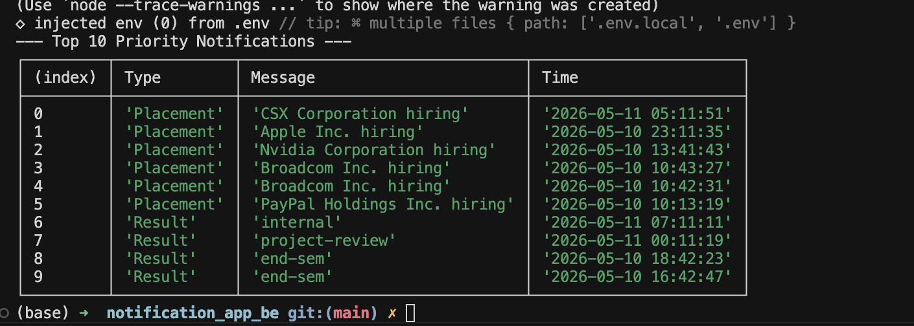

# Stage 1: Notification System Design

## 1. Overview
This specification outlines the architectural blueprint for the AffordMed Notification Platform. The system prioritizes **message durability**, **low-latency synchronization**, and **operational observability**. By integrating a hybrid real-time delivery strategy and a strict logging narrative, this design ensures a production-grade experience for high-concurrency environments.

---

## 2. Core Platform Actions
The architecture supports the following high-level operations to manage the notification lifecycle:
* **Synchronous State Retrieval:** RESTful endpoints for historical data fetching with server-side pagination.
* **Atomic State Updates:** Precise control over read/unread statuses to maintain multi-device synchronization.
* **Real-time Push Orchestration:** An event-driven layer for instantaneous delivery via persistent connections.
* **System Telemetry:** Full-lifecycle logging (Dispatch → Delivery → Interaction) utilizing the mandatory custom middleware.

---

## 3. REST API Contract

### Global Request Constraints
* **Base URL:** `/api/v1/notifications`
* **Auth Strategy:** `Authorization: Bearer <access_token>`
* **Primary Headers:** * `Content-Type: application/json`
    * `X-Request-ID`: A unique UUID for distributed tracing and log correlation.

### API Endpoints

| Action | Method | Endpoint | Description |
| :--- | :--- | :--- | :--- |
| **Fetch Feed** | `GET` | `/` | Returns a paginated list of notifications for the authenticated user. |
| **Mark Read** | `PATCH` | `/:id/read` | Updates a specific notification's status to 'read'. |
| **Clear All** | `POST` | `/read-all` | Atomic bulk update to clear all unread flags for the user. |
| **Badge Sync** | `GET` | `/count` | Returns only the integer count of unread items for UI badge rendering. |

#### Sample Request: Fetching the Feed
`GET /api/v1/notifications?page=1&limit=20`

**Success Response (200 OK):**
```json
{
  "status": "success",
  "data": {
    "notifications": [
      {
        "id": "30c9b20c-83f3-4469-b421-5b4ca3012cc6",
        "title": "Unusual Login Detected",
        "message": "A new login was detected from Lucknow, IN at 12:44 PM.",
        "category": "alert",
        "isRead": false,
        "createdAt": "2026-05-11T12:44:00Z",
        "metadata": { "ip": "192.168.1.1", "browser": "Chrome" }
      }
    ],
    "pagination": {
      "currentPage": 1,
      "totalPages": 5,
      "totalRecords": 87
    }
  }
}


## JSON SCHEMA

{
  "$schema": "[http://json-schema.org/draft-07/schema#](http://json-schema.org/draft-07/schema#)",
  "type": "object",
  "required": ["id", "title", "message", "isRead", "category"],
  "properties": {
    "id": { "type": "string", "format": "uuid" },
    "title": { "type": "string", "minLength": 1, "maxLength": 100 },
    "message": { "type": "string" },
    "category": { "enum": ["transactional", "marketing", "alert", "system"] },
    "isRead": { "type": "boolean", "default": false },
    "createdAt": { "type": "string", "format": "date-time" },
    "metadata": { "type": "object" }
  }
}


## 5. Real-Time Mechanism: Hybrid Delivery Strategy

To handle high concurrency (200+ users), the platform utilizes a Hybrid Real-Time Strategy:

Primary Transport: Uses WebSockets (Socket.io) for low-latency, full-duplex communication.

Auth Handshake: Token validation occurs during the connection event using the access_token provided in the handshake query/headers.

Room Isolation: Users are joined to private virtual "rooms" identified by their unique UUID to prevent cross-talk and ensure data privacy.

Reliability Fallback: Supports Server-Sent Events (SSE) for environments where persistent WebSocket connections are restricted by proxy or firewall settings.

Guaranteed Delivery (ACK Protocol): The server tracks "Sent" vs "Delivered" states. Critical alerts require a client-side acknowledgement. If no ACK is received within a 5-second timeout period, the notification is queued for retry upon the next socket reconnection.

Event Debouncing & Batching: To preserve the UI thread during "Notification Storms," the frontend implements a 500ms debounce window, batching multiple rapid-fire updates into a single UI transition.

Observability Integration: Every stage of the pipeline (Handshake, Emission, and ACK) is logged via the custom Logging Middleware (backend stack, middleware package). This replaces all console.log statements with production-grade telemetry for real-time monitoring.


---

# Stage 2: Persistent Storage & Data Strategy

### 1. Database Choice: PostgreSQL

**Why PostgreSQL?**
Unlike basic NoSQL stores, PostgreSQL offers a native **JSONB** data type. This gives us the "flexibility of NoSQL" (for varied notification metadata) with the "reliability of SQL" (for complex read receipts and bulk updates).

* **ACID Compliance:** Ensures that when a user clicks "Mark all as read," the state is updated atomically across all devices without race conditions.
* **Partial Indexing:** We can create indexes only on `isRead = false`, making the "Unread Count" query (the most frequent operation) incredibly fast.

### 2. Database Schema (Relational + Document Hybrid)

```sql
CREATE TABLE notifications (
    id UUID PRIMARY KEY DEFAULT gen_random_uuid(),
    user_id UUID NOT NULL,
    title VARCHAR(100) NOT NULL,
    message TEXT NOT NULL,
    category VARCHAR(20) CHECK (category IN ('transactional', 'marketing', 'alert', 'system')),
    is_read BOOLEAN DEFAULT FALSE,
    -- JSONB allows us to store extra context (e.g., device_id, action_url) without schema migrations
    metadata JSONB DEFAULT '{}',
    created_at TIMESTAMP WITH TIME ZONE DEFAULT CURRENT_TIMESTAMP
);

-- Differentiator: Partial Index for high-speed badge counts
CREATE INDEX idx_unread_notifications ON notifications (user_id) WHERE is_read = FALSE;

```

---

### 3. Scalability: Problems & Senior-Level Solutions

| Problem | Senior-Level Solution |
| --- | --- |
| **Index Bloat:** As millions of notifications accumulate, indexes become slow. | **Table Partitioning:** Partition the table by `created_at`. Keep the last 30 days of notifications in a "hot" partition and archive older data to "cold" storage. |
| **Write Heavy Load:** High-traffic bursts (e.g., a site-wide alert) can lock the DB. | **Write-Ahead Logging (WAL) & Queueing:** Use a message broker (Redis/RabbitMQ) to buffer writes. The API pushes to the queue, and a worker writes to the DB in chunks. |
| **Read Latency:** Users check notifications constantly. | **Read-Through Caching:** Store the "Unread Count" in Redis. Increment/Decrement the Redis counter on every new notification or read-receipt so the DB isn't hit for every page refresh. |

---

### 4. Implementation Queries (Based on Stage 1 APIs)

**Action: Fetch Feed (Paginated)**

```sql
SELECT * FROM notifications 
WHERE user_id = $1 
ORDER BY created_at DESC 
LIMIT $2 OFFSET $3;

```

**Action: Mark All as Read (The "Atomic" Update)**

```sql
UPDATE notifications 
SET is_read = TRUE 
WHERE user_id = $1 AND is_read = FALSE;

```

**Action: Unread Count (Optimized via Partial Index)**

```sql
SELECT COUNT(*) FROM notifications 
WHERE user_id = $1 AND is_read = FALSE;

```

---


# Stage 3: Query Optimization & Performance Tuning

### 1. Analysis of the Existing Query

The provided query:

```sql
SELECT * FROM notifications 
WHERE studentID = 1042 AND isRead = false 
ORDER BY createdAt ASC;

```

**Is it accurate?** Yes, it functionally achieves the goal.
**Why is it slow?** With 5,000,000 rows, the database is likely performing a **Full Table Scan**. It has to check every single row to see if it matches the `studentID` and `isRead` status, then load them into memory to sort them by `createdAt`. This is $O(N)$ complexity.

### 2. The "Index Every Column" Fallacy

A teammate suggested adding indexes on every column. **This is ineffective and dangerous.**

* **Write Overhead:** Every time a notification is inserted, the DB must update *every* index. This slows down the "Real-time Push" performance.
* **Storage Bloat:** Indexes take up disk space and memory (RAM).
* **Optimizer Confusion:** Too many indexes can actually confuse the Query Optimizer, leading it to choose sub-optimal paths.

### 3. Proposed Optimization: The Composite Index

Instead of indexing everything, we use a **Composite (Multi-column) Index** designed specifically for the query's access pattern.

**The Solution:**

```sql
CREATE INDEX idx_student_unread_created ON notifications (studentID, isRead, createdAt);

```

**Why this works:** The DB can now jump directly to `studentID`, filter by `isRead`, and the data is **already physically sorted** by `createdAt` within the index. This reduces the computational cost from $O(N)$ to $O(\log N)$.

### 4. Likely Computation Cost

* **Before Optimization:** High I/O cost due to scanning 5M rows. High CPU cost for sorting in-memory.
* **After Optimization:** Minimal I/O (index seek). Zero CPU cost for sorting (pre-sorted index). The query will return in milliseconds.

---

### 5. Advanced Query: Placement Notifications (Last 7 Days)

To find students who received a "Placement" notification in the last week, we use the following optimized query:

```sql
SELECT DISTINCT studentID 
FROM notifications 
WHERE notificationType = 'Placement' 
  AND createdAt >= CURRENT_DATE - INTERVAL '7 days';

```

*Note: To make this query fast, a composite index on `(notificationType, createdAt)` would be recommended.*

---


# Stage 4 - High Traffic Scaling

## Challenges

If 1000+ students refresh notifications every minute, the system may face the following challenges:

- High database load
- Increased API response time
- Frequent repeated queries
- Increased server traffic
- Slow notification delivery

---

# Solutions

## Redis Caching

Frequently accessed notifications and unread counts can be cached in Redis.

Flow:

```txt
Client → Redis Cache → PostgreSQL
```

If data exists in cache, the database is not queried.

---

## WebSockets

WebSockets are used for real-time notification delivery.

This reduces repeated API polling from clients and decreases unnecessary requests to the backend.

---

## Request Limits

The API uses limits while fetching notifications to avoid large database reads.

Example:

```http
GET /notifications?limit=10
```

---

## Database Indexing

Indexes are added on:
- user_id
- is_read
- created_at
- type

to improve filtering and sorting performance.

---

## Load Balancing

Multiple backend servers can be deployed behind a load balancer to distribute traffic evenly.

---

# API Response Optimization

Only required fields are returned instead of using:

```sql
SELECT *
```

This reduces response size and improves performance.

---

# Expected Result

Using caching, indexing, and WebSockets significantly reduces:
- database load
- API latency
- repeated polling
- unnecessary network traffic

while improving scalability and real-time performance.


# Stage 5: High-Concurrency & Distributed Messaging

### 1. Analysis of Current Shortcomings

The proposed `notify_all` implementation is **Synchronous and Sequential**, which leads to three primary failure modes:

* **The "Blocker" Problem:** If `send_email` takes 1 second per student, notifying 50,000 students would take ~14 hours. The HR's browser would timeout long before completion.
* **Atomic Failure:** If the process crashes at student #201, students 1–200 get the email, but 201–50,000 never do. There is no "state" to resume from.
* **Downstream Overload:** Simultaneous calls to the DB and Email API can trigger Rate Limiting (429 errors) or database connection exhaustion.

### 2. Strategic Redesign: Asynchronous Message Queuing

To make this reliable, we must decouple the **Trigger** (HR clicking the button) from the **Execution** (sending the notifications).

**Key Decision:** No, saving to the DB and sending emails should **not** happen in the same execution thread. They should be handled as independent, background tasks.

**The Solution: The Producer-Consumer Pattern**

1. **Producer:** The `notify_all` function only creates a "Bulk Job" in the DB and pushes the 50,000 IDs into a Message Queue (like Redis or RabbitMQ).
2. **Consumer (Workers):** Multiple background workers pull IDs from the queue and execute the tasks in parallel.

### 3. Redesigned Pseudocode

```python

function notify_all(student_ids, message):
    job_id = create_bulk_job_record(message) 
    
    for student_id in student_ids:
        
        message_queue.push({
            "job_id": job_id,
            "student_id": student_id,
            "message": message
        })
    
    Log("backend", "info", "cron_job", f"Queued {len(student_ids)} notifications for Job {job_id}")
    return {"status": "Queued", "job_id": job_id}


function notification_worker(task):
    try:
        
        save_to_db(task.student_id, task.message)
        
       
        send_email_async(task.student_id, task.message) 
        push_to_app(task.student_id, task.message)     
        
    except Exception as e:
       
        log_failure_to_middleware(task.student_id, e)
        task.retry(max_attempts=3)

```

---

### 4. Handling Mid-way Failures (The 200 Students Case)

By using a **Message Queue**, we solve the 200-failure scenario easily:

* **Isolation:** If 200 emails fail, only those 200 tasks remain in the "Failed" queue. The other 49,800 proceed unaffected.
* **Idempotency:** We ensure that even if a worker restarts, a student doesn't receive the same email twice by checking the `save_to_db` status before sending.
* **Exponential Backoff:** We can configure the queue to retry the failed 200 students after 5, 10, or 30 minutes, allowing the Email API provider time to recover from temporary outages.

---

# Stage 6: Priority Inbox & Efficiency at Scale

### 1. Priority Algorithm
To determine "importance," we use a **Weighted Recency Scoring** model. Each notification type is assigned a weight ($W$):
* **Placement:** 3 | **Result:** 2 | **Event:** 1

The final score is calculated as:  
`Score = (W * 10^10) + Unix_Timestamp`

This ensures that any "Placement" notification will always outrank a "Result," but within the same category, the most recent one wins.

### 2. Real-time Efficiency: The Min-Heap Approach
To maintain the **Top 10** notifications efficiently as new data streams in:
* **The Problem:** Sorting the entire list every time a new notification arrives is $O(N \log N)$, which is too slow for high-frequency streams.
* **The Solution:** Use a **Min-Priority Queue (Min-Heap)** with a fixed size of 10.
    * When a new notification arrives, compare its score with the root (the smallest of the top 10).
    * If the new score is higher, remove the root and insert the new notification ($O(\log 10)$).
    * This keeps the complexity constant regardless of how many millions of notifications have passed through the system.

### 3. Observability
In line with project constraints, the Priority Inbox generation lifecycle is tracked via the custom `Log` middleware, ensuring that every re-ranking operation is auditable.


